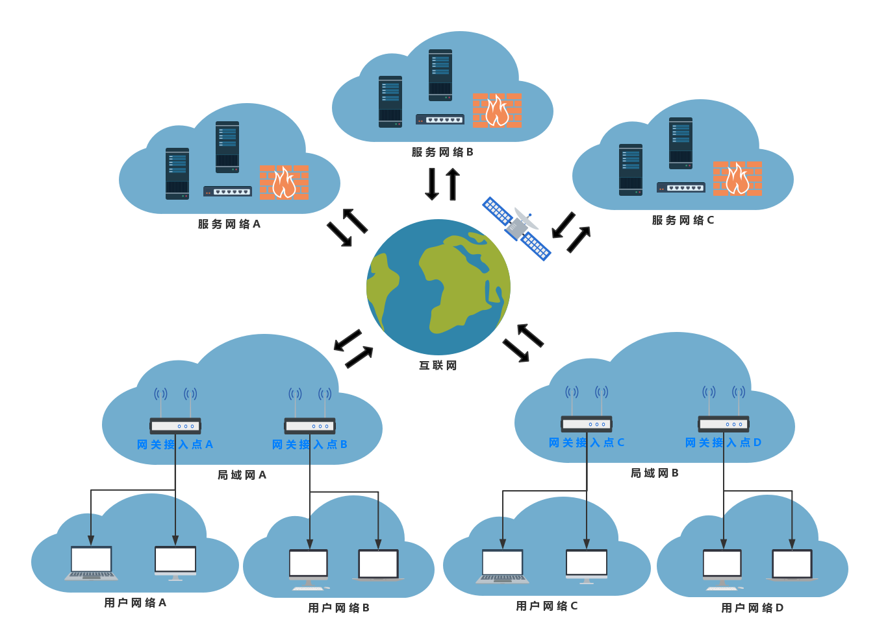
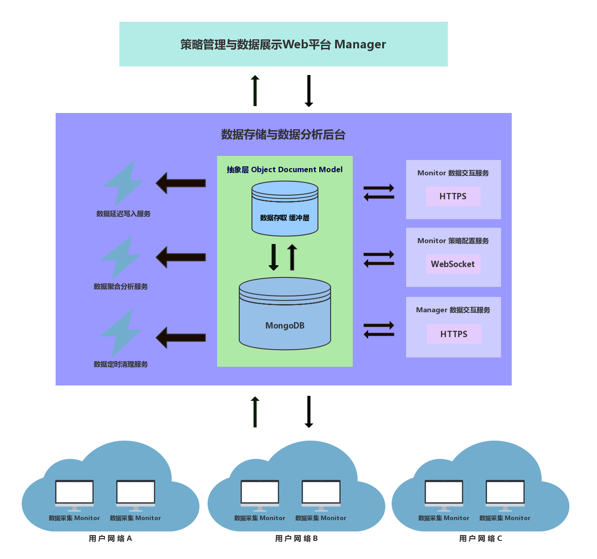

# Woodpecker 设计蓝图

## 设计阶段

1. 定义能够充分描述计算机网络通信特征的指标集合。
2. 精确的、低耗的、全面的和多平台的数据采集工具。
3. 实时的、简洁的、清晰的和多用户的数据展示平台。
4. 明确现象、故障、原因之间的层级划分及相互关系。
5. 充分的数据，完善的算法，实时且准确的故障定位。

## 概要设计

本课题设计并实现一个基于网络用户视角的网络检测系统 —— Woodpecker。

### 应用场景

基于网络用户视角:
- 终端设备经由网关接入互联网, 一个网关一般支持同时接入多个终端设备。
- 多个终端设备只有接入相同的网关, 才认为它们处于相同的网络环境, 称为用户网络。
- 抽象地, 根据网关将端到端的通信网络划分成三部分: 用户网络、互联网和服务网络。
- 互联网是透明的, 包括网关所在的局域网(例如校园网络, 企业网络等)。
- 服务网络是对提供特定网络服务集合的服务器集群及其网络设施的整体抽象。

Woodpecker 基于网络用户视角, 直接识别造成网络用户体验下降的异常, 定位故障源位置以及分析具体原因。

### 运行架构

**数据采集模块**
+ 数据采集模块在用户网络的终端设备上部署客户端(Monitor), 来收集实时的相关数据。
    - Monitor 监控终端设备的进出流量和性能指标, 分别按照应用进程和服务网络进行关联、聚集、统计和分析。
    - Monitor 采取主动轮询, 对终端设备最近常访问的服务网络周期性地发起报文探询, 收集延迟、丢包和路由等数据。
+ 数据采集模块的监控范围可扩展至用户网络所属的局域网内, 利用SNMP、sFlow、NetFlow等协议收集局域网内基础网络设施的相关数据, 构成分层数据采集模型。

**数据存储模块**
+ Woodpecker 采用 MongoDB, 并选用Redis或Apache Kafaka作为数据存储缓冲层。
    - MongoDB 具有良好的查询性能, 数据库设计比较简单。
    - 通过引入数据存储缓冲层, 降低Monitor提交数据的响应时间。
+ 数据存储模块提供数据查询和写入的接口, 并实现定时清理过期数据的守护进程。

**数据展示模块**
+ Woodpecker 基于 Vue.js 开发数据展示界面和策略管理界面。
+ 数据展示模块首先对数据进行简单地处理, 然后用Echarts.js模板进行可视化渲染, 最后交由前端Web界面展示。
+ 数据展示界面的可视化粒度分为终端设备、用户网络和局域网, 聚合范围和抽象层次依次增大。

**策略管理模块**
+ 策略管理模块是 Woodpecker 为管理员提供的系统配置界面, 包括多用户访问权限管理。
+ 通过策略管理, 控制 woodpecker 客户端对实际网络造成的负载, 并应对 woodpecker 后台可能出现的各种状况。
+ Woodpecker 的可配置项主要包括数据采集模块的运行策略, 数据存储模块的存储策略以及数据展示模块的展示策略。

**数据交互模块**
+ 数据交互模块提供通信接口, 用于客户端上传数据, 后台数据查询以及策略调整下发。
    - 上传数据接口和数据查询接口基于RESTful API, 鉴于对安全性的要求, 采用 https 协议。
    - 策略调整下发需要建立一个双向通信连接, 即允许服务端主动向客户端推送数据, 因此采用 WebSocket 协议实现。
