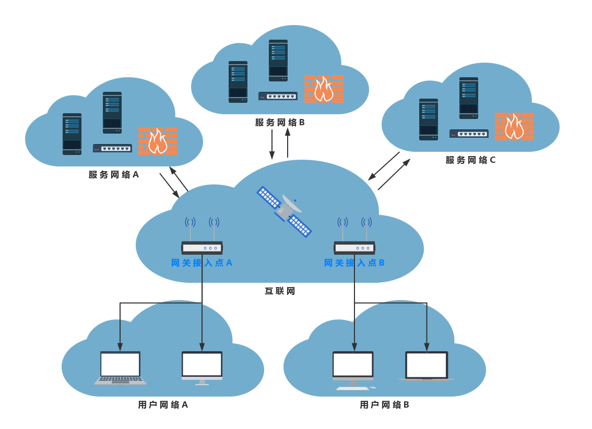
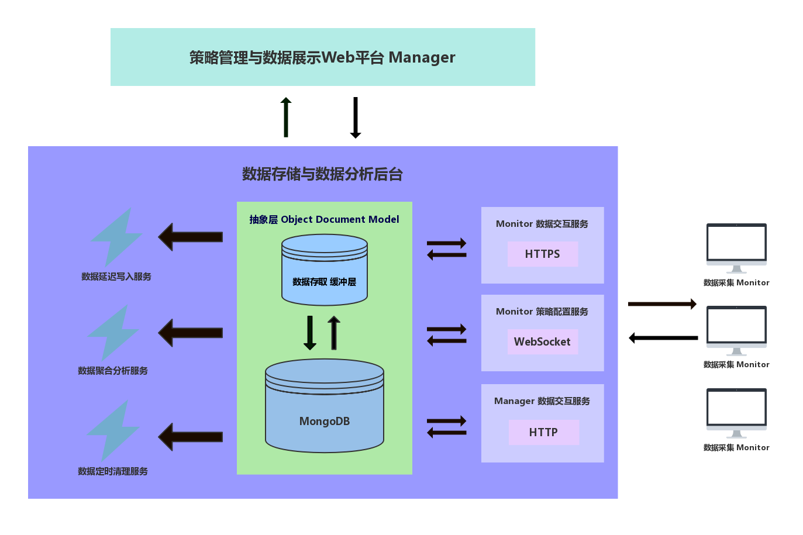

# Woodpecker 设计蓝图

## 设计阶段

1. 定义能够充分描述计算机网络通信特征的指标集合。
2. 精确的、低耗的、全面的和多平台的数据采集工具。
3. 实时的、简洁的、清晰的和多用户的数据展示平台。
4. 明确现象、故障、原因之间的层级划分及相互关系。
5. 充分的数据，完善的算法，实时且准确的故障定位。

## 概要设计

本课题设计并实现一个基于网络用户视角的网络检测系统 —— Woodpecker。

### 应用场景

基于网络用户视角:
- 终端设备经由网关接入互联网, 一个网关一般支持同时接入多个终端设备。
- 多个终端设备只有接入相同的网关, 才认为它们处于相同的网络环境, 称为用户网络。
- 抽象地, 根据网关将端到端的通信网络划分成三部分: 用户网络、互联网和服务网络。
- 互联网是透明的, 包括网关所在的局域网(例如校园网络, 企业网络等)。
- 服务网络是对提供特定网络服务集合的服务器集群及其网络设施的整体抽象。

Woodpecker 基于网络用户视角, 直接识别造成网络用户体验下降的异常, 例如网页加载失败、视频加载缓慢等, 分析和定位导致异常发生的故障源位置和具体原因 —— 用户网络、互联网或者服务网络。

### 运行架构

如图所示, Woodpecker 的运行架构由五个模块组成:
- 数据采集模块。
- 数据交互模块。
- 数据存储模块。
- 策略管理模块。
- 数据展示模块。

Woodpecker 主要有3种运行过程:
- 数据采集
- 数据展示
- 策略管理

- 首先在用户网络的终端设备上部署数据采集客户端(Monitor)实时收集相关数据
- 然后经由Monitor数据交互服务上传至数据存储后台,
